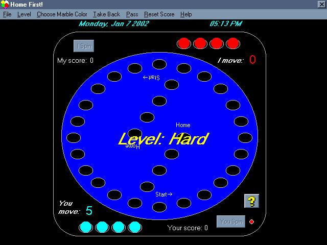



## Home First \(a marble game\)

### Description

You play against the computer. I wrote this game years ago for my children. The code is not commented and it's quite fat. I ask that you please play the game, and leave comments on improvements/additions. I will then rewrite the game to bring it up to speed, and incorporate your suggestions into it. :)
 
### More Info
 

             |
---                |---
**Submitted On**   |2002-01-13 17:08:20
**By**             |[Chris Seelbach](https://github.com/Planet-Source-Code/PSCIndex/blob/master/ByAuthor/chris-seelbach.md)
**Level**          |Advanced
**User Rating**    |5.0 (15 globes from 3 users)
**Compatibility**  |VB 4\.0 \(32\-bit\), VB 5\.0, VB 6\.0
**Category**       |[Games](https://github.com/Planet-Source-Code/PSCIndex/blob/master/ByCategory/games__1-38.md)
**World**          |[Visual Basic](https://github.com/Planet-Source-Code/PSCIndex/blob/master/ByWorld/visual-basic.md)
**Archive File**   |[Home\_First484821132002\.zip](https://github.com/Planet-Source-Code/chris-seelbach-home-first-a-marble-game__1-30772/archive/master.zip)

